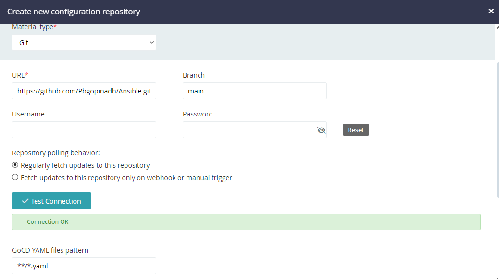

# GOCD:

Contionus deployment/delivery 

to install the GOCD we need to check the java version if we are instlling it via zip folder. if else the package contains the required java version JDK.

we are installing using ZIP so we have to make sure the java version is compatible with the GOCD server agent.

so basically we got an error saying that the space is not suffiecent in GOCD application. 

but the allocated size is 20 GB with additional 10GB. but heres the catch.

Linux divide the disk space as below. (lsblk)

NAME                 MAJ:MIN   RM  SIZE RO TYPE MOUNTPOINTS
xvda                 202:0      0   20G  0 disk
├─xvda1              202:1      0    1M  0 part
├─xvda2              202:2      0  122M  0 part /boot/efi
├─xvda3              202:3      0  488M  0 part /boot
└─xvda4              202:4      0 19.4G  0 part
  ├─RootVG-rootVol   253:0      0    6G  0 lvm  /
  ├─RootVG-swapVol   253:1      0    2G  0 lvm  [SWAP]
  ├─RootVG-homeVol   253:2      0    1G  0 lvm  /home
  ├─RootVG-varVol    253:3      0    2G  0 lvm  /var
  ├─RootVG-varTmpVol 253:4      0    2G  0 lvm  /var/tmp
  ├─RootVG-logVol    253:5      0    2G  0 lvm  /var/log
  └─RootVG-auditVol  253:6      0  4.4G  0 lvm  /var/log/audit
xvdbb                202:13568  0   10G  0 disk

here if we observer /home where the gocd is installed have only 960MB allocated to it as per the below.

df -Th
Filesystem                   Type      Size  Used Avail Use% Mounted on
devtmpfs                     devtmpfs  4.0M     0  4.0M   0% /dev
tmpfs                        tmpfs     377M     0  377M   0% /dev/shm
tmpfs                        tmpfs     151M  2.5M  149M   2% /run
/dev/mapper/RootVG-rootVol   xfs       6.0G  2.3G  3.8G  38% /
tmpfs                        tmpfs     377M     0  377M   0% /tmp
/dev/mapper/RootVG-homeVol   xfs       960M  520M  441M  55% /home
/dev/mapper/RootVG-varVol    xfs       2.0G  369M  1.6G  19% /var
/dev/mapper/RootVG-logVol    xfs       2.0G   74M  1.9G   4% /var/log
/dev/mapper/RootVG-varTmpVol xfs       2.0G   47M  1.9G   3% /var/tmp
/dev/xvda3                   xfs       424M  223M  202M  53% /boot
/dev/mapper/RootVG-auditVol  xfs       4.4G   64M  4.3G   2% /var/log/audit
/dev/xvda2                   vfat      122M  7.0M  115M   6% /boot/efi
tmpfs                        tmpfs      76M     0   76M   0% /run/user/1001

so we should always make sure to check the size of the directory when installing a package.
if the size is not suffiecient then we need to increase it.

so basically. filesystems concept is followed in linux.

so in video the VM is provisioned with 30GB volume and by following the below commands we have increased the 6GB of disk space.

 lsblk
NAME                 MAJ:MIN RM  SIZE RO TYPE MOUNTPOINTS
xvda                 202:0    0   20G  0 disk
├─xvda1              202:1    0    1M  0 part
├─xvda2              202:2    0  122M  0 part /boot/efi
├─xvda3              202:3    0  488M  0 part /boot
└─xvda4              202:4    0 19.4G  0 part
  ├─RootVG-rootVol   253:0    0    6G  0 lvm  /
  ├─RootVG-swapVol   253:1    0    2G  0 lvm  [SWAP]
  ├─RootVG-homeVol   253:2    0    1G  0 lvm  /home
  ├─RootVG-varVol    253:3    0    2G  0 lvm  /var
  ├─RootVG-varTmpVol 253:4    0    2G  0 lvm  /var/tmp
  ├─RootVG-logVol    253:5    0    2G  0 lvm  /var/log
  └─RootVG-auditVol  253:6    0  4.4G  0 lvm  /var/log/audit

growpart xvda(name of the volume) 4(partion under which the /home directory is present(xvda4)) - this is saying like we are increasing the partion 4 to the system.

df -Th
Filesystem                   Type      Size  Used Avail Use% Mounted on
devtmpfs                     devtmpfs  4.0M     0  4.0M   0% /dev
tmpfs                        tmpfs     377M     0  377M   0% /dev/shm
tmpfs                        tmpfs     151M  2.5M  149M   2% /run
/dev/mapper/RootVG-rootVol   xfs       6.0G  2.3G  3.8G  38% /
tmpfs                        tmpfs     377M     0  377M   0% /tmp
/dev/mapper/RootVG-homeVol   xfs       960M  520M  441M  55% /home
/dev/mapper/RootVG-varVol    xfs       2.0G  369M  1.6G  19% /var
/dev/mapper/RootVG-logVol    xfs       2.0G   74M  1.9G   4% /var/log
/dev/mapper/RootVG-varTmpVol xfs       2.0G   47M  1.9G   3% /var/tmp
/dev/xvda3                   xfs       424M  223M  202M  53% /boot
/dev/mapper/RootVG-auditVol  xfs       4.4G   64M  4.3G   2% /var/log/audit
/dev/xvda2                   vfat      122M  7.0M  115M   6% /boot/efi
tmpfs                        tmpfs      76M     0   76M   0% /run/user/1001

lvextend -r -L +6G /dev/mapper/RootVG-homeVol (this is where the /home is present in the disk) (this is us increasing the /home directory to 7GB)

But i took different approcah. i have already spawned the VM with 20GB and later added 10GB of data. so i have followed the below to add 6B to the /home directory

please check this URL for the steps taken - https://chatgpt.com/share/67ef4cbe-ba18-4df4-b516-445ce137503a

The backticks (`) are a feature in Unix-like shell environments (such as bash) used for command substitution. Command substitution allows you to execute a command and use its output as part of another command. Here’s a detailed explanation:

how to know the volume group is using this command sudo vgs

------------------------------------------------------------------------------------------------------------------------------------------------------------------------------------

GOCD terminology:

Material: source repo

What is a pipeline?

what is GITOPS?

writing everything in the form of code is GTIOPS why code and not GUI. if someone makes anychanges in GUI nobody knows. But if its as code we can understand the sequence, characterstics and behaviour, logic have changed history of file etc.

GitOps: using git for deployment of infrastructure and application.

How to assing a slave to the master:
 
Vim to this /home/gocd/go-agent-23.5.0/wrapper-config/wrapper-properties.conf in slave machine and add the private IP of master to this parameter wrapper.app.parameter.101 in the file.

the installation is same for both

CI focuses on integrating code changes and ensuring they don’t break the build or existing functionality through automated testing.
CD takes the next step by automatically deploying the successfully tested code to production, allowing for rapid and reliable delivery of software.

shallow clone for quick clone of git -> by using the git clone --depth=1 gitURL

The git clone --depth=1 <gitURL> command is used to create a shallow clone of a Git repository, where only the latest commit (the most recent snapshot of the repository) is retrieved. This command is particularly useful when you only need the most recent version of the code and want to minimize the amount of data transferred and storage used.

by using this the git cloning will be fast.

 ->  in the image we kept **/*.yaml for GOCD config part (GOCD will check all the repo folders and all the files that are ending with .yaml)

https://chatgpt.com/share/a6723402-d6db-40ff-906f-4ab212a2a5d1 - see this for the explanation of the parameters of the pipeline
